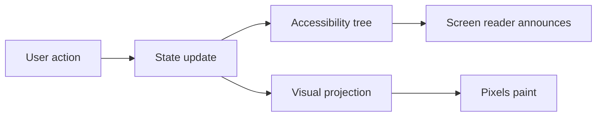

Most component libraries treat accessibility as a layer applied near the end: ship the visuals, then bolt on ARIA. This is a placeholder case study showing the article template, so the prose here is illustrative rather than final.

When the screen reader is the primary client, the architecture changes. The component's public API stops being "what does it look like" and starts being "what does it announce, and when."

## The core idea

Every interactive component exposes its state through semantics first and styling second. The visual layer is a projection of the semantic layer, never the source of truth.

### A small example

A toggle is a button with `aria-pressed`, not a styled `div` with a click handler:

```tsx
function Toggle({ pressed, onChange, label }: ToggleProps) {
  return (
    <button
      type="button"
      aria-pressed={pressed}
      onClick={() => onChange(!pressed)}
    >
      {label}
    </button>
  );
}
```

The visual "on/off" state derives from `aria-pressed` via CSS, so the announced state and the painted state can never drift apart.

## How a state change flows

The data flow puts the accessibility tree on the critical path, not to the side of it:



Because both the announcement and the paint are downstream of the same state update, there is no path where the screen reader and the screen disagree.

## What it bought us

- Fewer bugs of the "looks fine, reads wrong" variety
- A test suite that asserts on roles and names, not class names
- Components that survive a redesign without re-auditing accessibility

For the source and a live demo, see the links at the top of this article.
