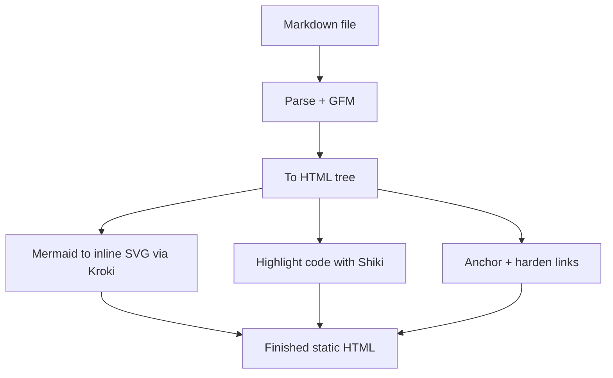

This site has a single governing constraint, and almost every technical decision falls out of it: the page must be correct before a line of JavaScript runs, and it must read beautifully to a screen reader. I am blind and I build through one, so accessibility here is not a pass at the end. It is the argument the site is making.

That constraint is freeing rather than limiting. When the finished HTML has to be right on its own, a lot of cleverness simply moves to build time, where it belongs.

## The browser gets a finished document

The whole site is a statically exported Next.js App Router project. `next.config.ts` sets `output: "export"`, so the build produces plain HTML, CSS, and a little optional JavaScript, served straight from a CDN. There is no server runtime in production and no per-request rendering. Every route is renderable at build time or it does not ship.

The payoff is the kind a crawler and a screen reader both appreciate: the document that arrives is the document, fully formed, fast, and identical whether or not scripts load.

## The build does the hard part

Articles are Markdown files. A single `unified` processor turns each one into HTML at build time, and the order of that pipeline is deliberate:

```ts
const processor = unified()
  .use(remarkParse)
  .use(remarkGfm)
  .use(remarkRehype)
  .use(rehypeMermaidKroki) // before Shiki, so mermaid isn't treated as code
  .use(rehypeShiki, { theme: "github-light" })
  .use(rehypeSlug)
  .use(rehypeAutolinkHeadings, { behavior: "append" })
  .use(rehypeExternalLinks, { target: "_blank", rel: ["noopener", "noreferrer"] })
  .use(rehypeStringify, { allowDangerousHtml: true });
```

Each stage does a job the browser would otherwise have to do, or could not do at all:



The diagram you just read was produced by the pipeline it describes. Mermaid code fences are posted to a Kroki service at build time and the returned SVG is inlined directly into the page, cached on disk so repeat builds do not refetch. There is no client-side diagram library and no headless browser. The accessibility comes from the source: authors write `accTitle:` and `accDescr:` inside the diagram, and those become the SVG's title and description, so the picture has a real text alternative rather than an empty `role="img"`.

Code is highlighted by Shiki, also at build time, so there are themed tokens with zero client JavaScript. External links are hardened in the same pass: they get `rel="noopener noreferrer"`, a new-tab target, and a screen-reader-only "opens in a new tab" cue, automatically, on every outbound link. Nobody has to remember to add it.

## Content is a folder, not a database

There is no CMS and no admin panel. Content is files in the repository, and the build discovers them. Drop a Markdown file into `content/articles/` and it ships: `generateStaticParams` enumerates the folder and a static route appears.

Projects work the same way. Each one is a small Markdown file with frontmatter, discovered exactly like an article:

```ts
function getSlugs(): string[] {
  if (!fs.existsSync(PROJECTS_DIR)) return [];
  return fs
    .readdirSync(PROJECTS_DIR)
    .filter((f) => f.endsWith(".md"))
    .map((f) => f.replace(/\.md$/, ""));
}
```

No array to edit, no route to register, no deploy step beyond a git push. The repository is the source of truth, and adding to the site means adding a file to it.

## One feed, no broken links

The home page does not separate "writing" from "work." A small module merges article metadata with the project files into one feed, sorted newest first, so the page reads as a single timeline of things made and written.

The interesting rule lives in how a project becomes a link. A project is only clickable once it has somewhere honest to point: a live URL, a source repository, or a write-up like this one. Until then it renders quietly with its status, and a live URL is what earns the gentle pulsing "Live" indicator. The invariant is that no broken or aspirational link ever ships. A project that is still cooking simply says so.

## Motion that can never hide content

The site has choreographed scroll reveals, and they are real animations. But they are layered on so carefully that they can never become a barrier. Three pieces cooperate, and the contract between them is strict.

First, an inline script in the document head decides whether motion is allowed at all, before the first paint:

```js
(function () {
  try {
    if (!matchMedia("(prefers-reduced-motion: reduce)").matches) {
      document.documentElement.classList.add("anim");
    }
  } catch (e) {}
})();
```

That `.anim` class lands on `<html>` only when JavaScript is running and the visitor has not asked for reduced motion. Second, the CSS hides reveal targets only under `.anim`. Third, a single small client component watches for elements scrolling into view and reveals them.

The net effect is the part I care about: with JavaScript off, or with reduced motion on, every reveal target is fully visible from the start. Nothing is gated behind a script. The animation is something the page can do, never something the content depends on. If the JavaScript never arrives, you lose the choreography and lose nothing else.

## The small details that are not small

The typeface is Atkinson Hyperlegible, designed by the Braille Institute for maximum legibility including for low-vision readers. It is part of the argument, not decoration, and it does every job in the system through weight and scale rather than by adding more fonts.

The color is committed sea-green with a warm amber counterweight, defined as OKLCH tokens. Every text-on-background pairing is verified against WCAG AAA by a script that runs as part of the build. If a color cannot hit AAA in context, the color changes, not the standard. The tokens are deliberately declared in two places, the stylesheet and the contrast checker, precisely so the check can prove they agree.

## The point

Almost none of this is visible. A finished document, diagrams that are really SVG, motion that politely steps aside, contrast you never have to think about: when it works, it disappears. That is the intent. The craft is in the part you do not notice, and the proof that it is real is that it reads just as well with your eyes closed.
