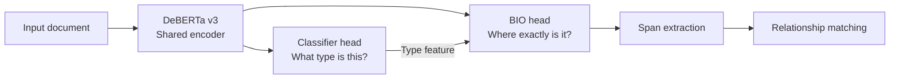
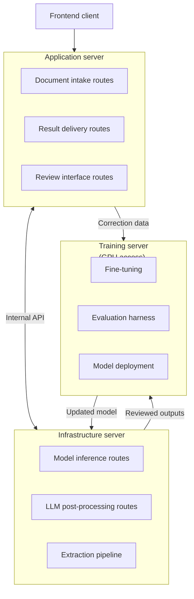
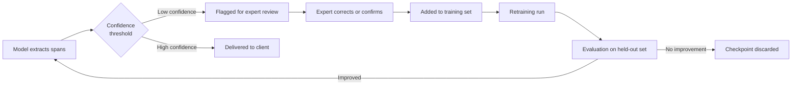

A Fortune 500 client had a document workflow that required extracting specific relationships between content across long, structured documents. The kind of workflow where a mistake carries real financial consequence, and where the people doing it well had spent years developing judgment that was hard to articulate and harder to transfer.

The instinct was to reach for RAG. It's the obvious tool. But the more we looked at what the workflow actually required, the clearer it became that retrieval wasn't the right foundation. We built a fine-tuned multi-task model instead, cut the workflow from weeks to hours, and reduced cost per run from around $5,000 to under $10.

This is the story of the decisions that got us there.

## Why RAG wasn't the right tool

RAG works by converting text into vector embeddings and retrieving chunks based on similarity to a query. For question answering, summarization, or lookup tasks, it's a reasonable fit. For this workflow, it wasn't.

The problem wasn't retrieval accuracy in isolation. We tested contextual compression and HyDE (Hypothetical Document Embeddings) to improve what the retriever surfaced, and both helped at the margins. The fundamental issue was that the task required identifying relationships between specific content pieces across a document, not retrieving the most similar chunks to a query.

```mermaid
flowchart TD
  accTitle: Why RAG falls short for relationship extraction
  accDescr: RAG retrieves similar chunks independently, then attempts to reason about relationships. ML identifies entity types first, then matches relationships with full context.

  subgraph RAG["RAG approach"]
    A[Query] --> B[Vector similarity search]
    B --> C[Retrieved chunks]
    C --> D[LLM reasons about relationships]
    D --> E[Output: not guaranteed accurate]
  end

  subgraph ML["ML approach"]
    F[Document] --> G[Classifier: what type is this span?]
    G --> H[BIO tagger: where exactly are the spans?]
    H --> I[Relationship matching with full context]
    I --> J[Output: deterministic within model confidence]
  end
```

Vector similarity finds chunks that look alike. It doesn't reliably find chunks that are meaningfully related when that relationship depends on document structure, position, or entity type. You can prompt an LLM to reason about those relationships after retrieval, but you're now stacking two sources of uncertainty: imperfect retrieval and imperfect reasoning. For a workflow where accuracy directly governs millions in revenue, that wasn't acceptable.

ML offered a different path. Identify the individual content pieces first, classify what type each one is, then match relationships deterministically. The model's job is bounded and explicit at each step. The accuracy is measurable and improvable.

## The task head architecture

We used DeBERTa v3 as the encoder. The shared encoder is the key ingredient: it means anything the model learns about the document's language and structure benefits both task heads simultaneously.

Rather than training a single sequence labeling head end to end, we structured the model with two heads in sequence: a classifier that identifies what category a given span belongs to, followed by a BIO (Beginning, Inside, Outside) tagger that identifies exact span boundaries within a 100-token sliding window.

The reason for this ordering: span boundary detection is much easier when the model already has a strong signal about what it's looking for. The classifier narrows the problem before the BIO head has to solve it.

The practical consequence was significant. By passing the classifier's output as a feature into the BIO head, the shared encoder could transfer learning across both tasks. That compression of information meant the model didn't need to learn everything from scratch at the boundary detection stage. It dropped our required training data from tens of thousands of examples to around 4,000 labeled examples. That is a meaningful difference when labeling is expensive and the people who can do it correctly are the same subject-matter experts whose time you're trying to save.

The CRF layer on top of the BIO head enforced valid label sequences. A raw neural BIO tagger can produce sequences like `I-TYPE` following `O`, which isn't a valid span. The CRF treats the label sequence as a structured prediction problem and rules out invalid transitions, which improved extraction precision on the kinds of edge cases that matter most in an accuracy-dependent workflow.

## The three-service architecture

Running an ML system in production requires separating concerns that get tangled quickly if you treat it as a single deployment. We split the system into three services with distinct responsibilities.

The **application server** handled everything the frontend touched: document intake, result delivery, and the review interface where subject-matter experts could correct extractions. Keeping this layer separate from the ML logic meant the client-facing surface was stable and independently deployable.

The **infrastructure server** held the ML and LLM routes: inference, post-processing, and the extraction pipeline that combined model output into structured results. This is the layer that does the expensive work, and isolating it meant it could be scaled or swapped without touching the application layer.

The **training server** had GPU access and owned the full model lifecycle: fine-tuning, evaluation, and deployment back to the inference layer. This is where the flywheel matters.

Every correction a subject-matter expert made through the review interface became a labeled training example. The model's uncertainty on a given extraction flagged it for review. Reviewed and corrected outputs went back into the training server. The training server ran evaluation, and if the new checkpoint improved on held-out metrics, it deployed to the inference server.

The effect over time is that the model gets better at exactly the cases that were hardest, because those are the ones that generated the most expert review. The knowledge of the people who understood the workflow best got encoded into the model systematically rather than staying locked in their heads.

## What it produced

The workflow that had taken weeks of expert time per run completed in hours. Cost per run dropped from approximately $5,000 to under $10. Extraction accuracy reached 93% on the held-out evaluation set.

The more durable result is the architecture. A system where expert corrections automatically improve the model doesn't just solve the current workflow. It standardizes accuracy for a process where variability carries real financial risk, and it gets more accurate as it's used. That's a different kind of value than a one-time automation.

RAG would have been faster to build. It wouldn't have been good enough.
