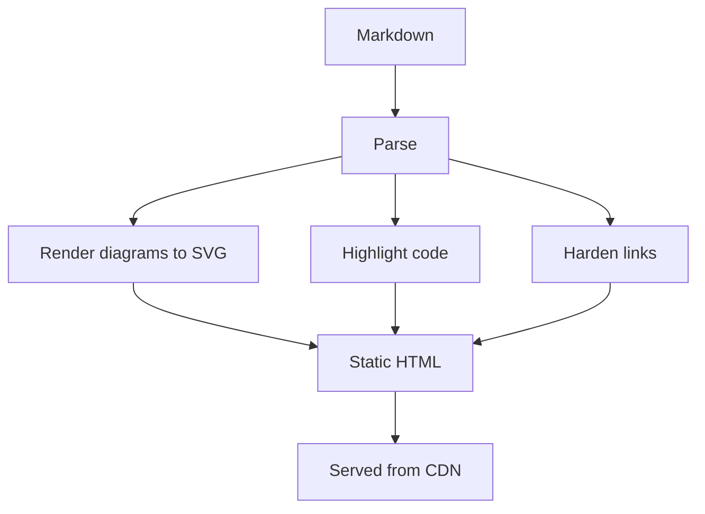

Placeholder case study. A static site should ship correct HTML before a single byte of JavaScript runs. That principle pushes a surprising amount of work to build time.

## The build does the hard part

Diagrams render to inline SVG at build time. Code highlights at build time. External links get their `rel` and new-tab semantics at build time. The browser receives a finished document.

```ts
const html = await processor.process(markdown);
// html is complete: SVG diagrams, highlighted code, safe links.
```

## Where each concern lives



The payoff: the page is fast, crawlable, and works identically whether or not scripts load.
